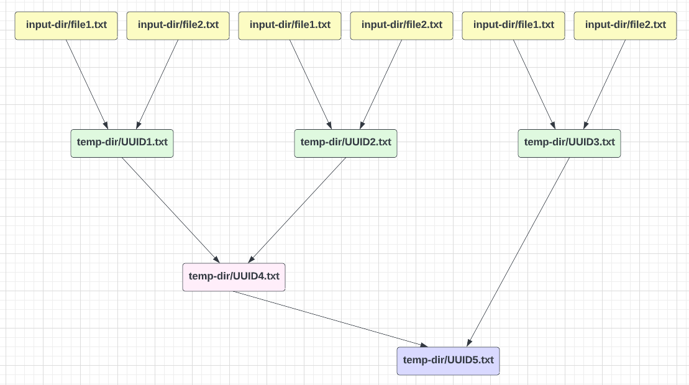

# merge_files
A python script to merge text files


## Environment Setup
The program is written in Python2. Please make sure Python2 is instailled in the machine.


## Running the code
Please download the program and run the program in your terminal
```
pyhton merge.py <input directory name> <output file path>
```
The `input directory name` needs to be a directory that already exist, and have at least one file in the directory.

Here is an example
```
python merge.py input_dir output_dir/result.txt
```

## How does it work?

In this diagram we assume that there are 6 files in the input directory, but the script can work with arbitrary number of files
1.  The program spins up [several processes](https://github.com/yc2423/merge_files/blob/dev/merge.py#L105)
2.  A process merges two files in the input directory, and save the result in a temporary output file
    - In the program we spin up 5 process, so there will be only at most 10 input files get opened at the same time
3.  After all the files get merged once,(the yellow files in the graph all get merged to green files), processes do the second round of merging(merge green files to purple files)
4.  If the content in a temp file has been merged to a new temp file, the old temp file will be deleted before the new round of merging process
5.  The merging process are repeated until there is only one file left in the temp directory
6.  Rename the last temp file and move it to the output directory
7.  Remove the temp directory


## Complexity Analysis

### Time complexity 
We need to consider the case that there may be a large number of files in the input directory, and the size of each file can be large. Therefore in the script, we try to merge two files at once.
We don't want to open all files at the same time and merge them together. We also don't want to merge each file to a giant output file.
Each time when a process merges two files, the result is saved in a new temporary file, because we are not sure if the memory is large enough to store all temporary results.

If the max size of each input file is `M` and there are total `N` input files. The time complexity would be `O(MN*logN)`. After each round of the merging process, the remaing file count will be divided by 2, so there wil be `logN` round of merging, and in each round of merging, there will be at most `N` files, and we need to look though `M` lines in each file. 

Actually in the script we spin up 5 process to do the merging work, so the actual time complexity should be smaller than `O(MN*logN)`.

### Space complexity
We store the temporary merging result in temporary files. There will be at most `N` temp files in each merging round, and each file size could be at most `MN`. Therefore the space complexity could be `O(MN^2)`. However the result is stored in the disk. 


## Edge Case
We need to consider the case that there is only one file in the input directory. In this case we just need to remove blank lines and duplicate words in the input file, and write the result to output files.
